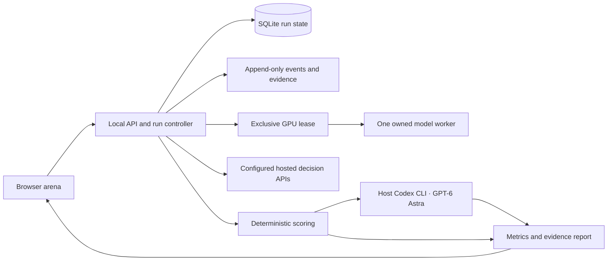

# Jev Arena — end-to-end build and verification plan

**Status:** researched specification, 27 September 2026. Build has not started. The user confirmed **plan first** and **GPT-6 Astra through Codex CLI** as the judge.

## Intended result

A local web app that makes a rigorous Jev-versus-alternatives evaluation compelling to watch. After initial setup, one **Impress** button runs the entire selected suite, downloads any missing approved artifacts, loads and unloads models in sequence, saves raw results, runs the CLI judge, and opens a results dashboard. The same run can be replayed side by side and exported for viewers to inspect.

The public GitHub release includes the application, pinned setup, dataset recipes, owned evaluation cases, scoring code, example results, and a recording-friendly replay. Viewers can run their own models or inspect a saved result without owning a GPU.

Research supports a broader comparison than Jev versus Laya alone. The main roster is **Jev, Plumb-4B, decider-4b v2, Winnow-12B Q8, SemIf, CLM-8B, Nimble 9B and Laya English**. Diagnostic entrants are **Laya typed-decisions, Laya multilingual, a normal Qwen3.5-4B JSON baseline and ModernBERT NLI**. Roster details and sources are in [RESEARCH.md](RESEARCH.md); the exact test and scoring contract is in [EVALUATION.md](EVALUATION.md).

No model is a predetermined winner. The app should answer “worth using for which workload?” through measured quality, usable coverage, latency, calibration and costs.

## Product and visual direction

**Visual thesis:** a precise broadcast control room, with graphite surfaces, oversized tabular numbers, fine rules and one electric-lime action accent. The data itself supplies the spectacle.

**Content plan:** open directly into the arena workspace; show run readiness and the main action; reveal progress, evidence and final comparisons in the same visual language. Avoid a marketing landing page and a grid of decorative metric cards.

**Interaction thesis:** a short start sequence focuses the active model lane; streamed measurements progressively draw the performance frontier; opening a result smoothly expands its evidence inspector. Animation follows actual events and respects reduced-motion settings.

### Required screens

| Screen | Dominant content | What it lets the presenter do |
|---|---|---|
| **Arena** | Wide model-lane table with one active local GPU lane, suite progress and a large Impress action | Start the full run and explain what is being measured |
| **Live run** | Current case, model answer distribution, actual elapsed time, task progress and compact resource strip | Show decisions arriving and inspect a failure without stopping the run |
| **Results** | Accuracy-versus-latency frontier above a dense sortable comparison table | Explain tradeoffs; filter by task family, deployment and adaptation status |
| **Confidence** | Reliability diagram and coverage-versus-error curve | Move a threshold and show the measured automation/escalation tradeoff |
| **Case explorer** | Shared input, rubric, per-model answer, gold source and judge evidence | Show exactly why a model passed or failed |
| **Replay / presenter** | Up to four synchronized recorded lanes or simulator views | Film clear A/B comparisons on a single GPU |
| **Setup / provenance** | Readiness checks, model inventory, artifact versions and costs | Fix concrete setup issues and prove the run's provenance |

Main workspace composition:

```text
JEV ARENA             Full v1 · 12 entrants · Judge: Astra       [Impress]
────────────────────────────────────────────────────────────────────────
Suite readiness / current stage                         Run ID · elapsed

Model                  Quality    Coverage     p50      p95       State
Jev 1.13.0                 —          —         —        —       queued
Plumb-4B                   —          —         —        —       loading
…
────────────────────────────────────────────────────────────────────────
Quality / latency frontier             Current decision / evidence
────────────────────────────────────────────────────────────────────────
GPU memory · temperature · downloaded assets · judge queue · spend
```

At 1920×1080 and 2560×1440, the main comparison and primary action must fit without scrolling. Use at most two typefaces, clear labels, readable axes and sufficiently large text for a compressed YouTube recording. Color reinforces status; labels and shapes carry the meaning. A 390-pixel view reorganizes into a compact table/inspector without losing controls.

Preserve distinctions in the UI: **live / recorded / illustrative**, **measured / estimated**, **general / adapted**, **native probabilities / transformed scores**, and **complete / partial / judging incomplete**. Never animate invented measurements while waiting. Presenter mode can hide setup detail, but must retain the run identity and replay/sample labels.

Exports: self-contained read-only HTML report, JSONL raw decisions, CSV metrics, run manifest, judge audit and PNG/SVG charts. Include accessible data tables behind charts. Initial static example results are explicitly illustrative; replace or supplement them with a verified recording once available.

## Architecture and repository structure

Use **React + TypeScript + Vite** for the browser; **FastAPI + Pydantic** for the local API; SQLite for durable run state; JSONL and Parquet for evidence and analysis. Use SSE for progress with monotonic event IDs and reconnection support. This is a proposed stack; pin compatible versions during the first build spike.

Keep the host controller and Codex judge on Windows so they use the existing login. Put CUDA workers in pinned Linux containers under Docker Desktop/WSL2, with equivalent Linux launch scripts. This avoids requiring every experimental model runtime to work directly on Windows. Native runtime references remain the correctness baseline.



Proposed layout:

```text
apps/web/                    arena, dashboard, replay, setup
services/api/                local API, SSE, run state, supervisor
services/judge/              Codex subprocess runner and validated schemas
packages/contracts/          schemas shared with the frontend
adapters/                    one adapter per model/runtime family
workers/                     pinned container recipes and health endpoints
evals/importers/              licensed upstream loaders and transforms
evals/fresh/                  owned dev/calibration/test cases
evals/scorers/                deterministic metrics and statistics
evals/protocols/              frozen run manifests and workload presets
tests/                       contract, metrics, lifecycle, UI and release checks
scripts/                     setup.ps1, setup.sh, doctor, download, run, export
docs/                        methodology, model cards, setup and screenshots
artifacts/runs/<run-id>/      local raw evidence, metrics, reports
```

The server binds to loopback by default. Model commands come from a fixed adapter registry, never arbitrary strings sent by the browser. Browser-triggered mutations require a local session token and origin checks. Credentials stay server-side, scoped to the proper provider, omitted from logs and exports. The publicly shareable report contains no execution controls or secrets.

Workers receive only the case payload and necessary weight mounts. Gold and judge artifacts stay outside their container mounts. Run each experimental runtime with an isolated dependency set. Installation may access artifact hosts; local evaluation workers should need no network. Inspect any required remote model code and pin it before enabling it.

### Durable run state

Persist `runs`, `entrant_configs`, `cases`, `predictions`, `attempts`, `judge_jobs`, `metrics`, `events`, and `artifact_hashes`. Give prediction jobs a unique `(run, entrant, case, question, repetition)` identity and judge jobs a versioned content hash. Save results before emitting a completion event.

The immutable run manifest includes code commit; suite and dataset hashes; resolved model, adapter and container revisions; all limits and precision; prompts; seeds; cache settings; host hardware; requested judge model/effort; cost basis; and enabled/required entrants. Never use a moving `latest` reference in a scored manifest.

The planned local API surface is deliberately small: `GET /readiness`, `GET /models`, `GET /suites`, `POST /runs`, `GET /runs/{id}`, `GET /runs/{id}/events`, `POST /runs/{id}/cancel`, `POST /runs/{id}/resume`, `GET /runs/{id}/results`, and `GET /runs/{id}/export`. Start/resume use idempotency keys; SSE replays from an event cursor; all responses use versioned schemas. The same controller also has a CLI entry point so automation and browser runs cannot diverge.

## What Impress does

After onboarding, **Impress defaults to Full v1**, including all configured required entrants. Smoke and Demo are explicit alternate presets. A run never silently becomes a smaller run because a dependency fails.

1. **Preflight:** verify disk estimate, hashes, dataset availability, driver/container GPU access, provider credentials, Codex ChatGPT login and Astra smoke result, spending cap, and required model capabilities. Show a single actionable readiness list.
2. **Freeze:** generate run ID, lock the manifest and schedule; acquire a controller lock. A double click must return the same run, not launch twice.
3. **Prepare artifacts:** fetch missing approved weights and container layers with progress, checksums and resume support. Cache them across runs. Record download/compile time separately from inference.
4. **For each entrant:** acquire the GPU lease when needed; create its owned worker; wait for real health and a valid response; record load cost; warm up; run applicable quality, robustness, performance and episode packs; checkpoint results; unload; verify resource release.
5. **Score:** calculate deterministic metrics continuously. Queue blinded semantic judgments after outputs have been durably saved. Keep judging out of measured candidate latency.
6. **Judge:** run the frozen Astra rubric and its controls with bounded concurrency/retry. Use saved reference annotations; fresh label construction belongs to suite preparation, not to a candidate's run.
7. **Verify:** reconcile scheduled jobs against completed/error/unsupported records, hashes, metrics and resource cleanup. Produce an explicit incomplete state if required work remains.
8. **Present:** open the dashboard, save the replay and exportable report, and show the coverage and judge status alongside findings.

The state machine is persisted: `preflight → preparing → loading → warming → evaluating → unloading → judging → verifying → complete`. Terminal alternatives include `failed`, `cancelled`, and `partial`; `paused_for_user` covers an account or budget issue. Stages can overlap only where timing and resource isolation remain valid.

### Failure and recovery behavior

| Event | Required behavior |
|---|---|
| Required model/access missing | Fail readiness before starting. Offer the exact fix; let the user explicitly choose a separate local-only preset. |
| OOM or incompatible kernel | Save failure evidence, stop the owned worker and clear its GPU lease. Do not silently quantize or reduce context; a changed config creates a new entrant/run. |
| Model crash | Preserve completed cases; restart at most once under the same manifest, mark the affected performance block invalid and rerun that block. |
| API throttling | Respect Retry-After, bounded backoff, attempt ledger and budget reservations. Surface first-attempt and effective latency. |
| Judge auth/quota failure | Persist the judge queue; candidate evidence survives. Resume pending judgments without re-running inference. |
| Browser refresh/disconnect | Controller continues; UI reconnects from the last event ID and authoritative saved state. |
| Controller interruption | Mark in-flight jobs uncertain, reconcile owned workers, resume idempotently. Do not claim exactly-once billing for an ambiguous remote request. |
| Cancel | Stop scheduling, cancel in-flight requests, terminate only run-owned processes/containers, release memory, save a partial report. |
| Failed unload | Do not load the next GPU model. Attempt owned-process cleanup, then report a blocked resource with its identity. |

For unloading, verify the process/container exited and its port closed, then sample memory for three stable readings within the pre-run baseline plus a proposed 512 MiB tolerance. If desktop memory fluctuations make that threshold unreliable, record the condition and require owned-allocation/process evidence; do not simply declare success after calling an empty-cache function. Never terminate another project to obtain a clean benchmark.

Use configurable but bounded operational deadlines: 10 minutes for a cached worker to become ready, 60 seconds per ordinary candidate request, 120 seconds for a declared long-context profile, and 60 seconds for unload/cleanup. First-download and compilation phases have separate progress-based timeouts. A failed candidate deadline counts as a failure; extending a limit after seeing scores creates a new configuration. Persist the chosen limits in the manifest.

## Build sequence and verification rounds

Each round ends with saved evidence. Fix failures and repeat the affected checks before expanding scope. Progress does not depend on repeated user review of routine implementation details.

| Round | Build work | Exit gate and evidence |
|---|---|---|
| **0 — Feasibility and frozen scope** | Resolve all primary roster revisions/licenses; test Docker CUDA on the 5090; acquire Jev access; run a schema-bound Astra smoke; estimate downloads; freeze suite v1. | `doctor.json` records each dependency as verified or pending. Every required entrant has a reachable artifact and an explicit capability matrix. One valid Jev response, one local response and one actual Astra verdict. No inferred success from executable existence. |
| **1 — Real vertical slice** | Arena shell, local API, durable state, Jev and Laya adapters, 36 contract cases, CLI judge and minimal results table. | One button completes real calls, scoring and judging, unloads the local model and reloads the page with the same results. Every displayed measurement links to raw evidence. No illustrative fixture enters the result aggregate. |
| **2 — Inputs, adapters and data** | Add remaining adapters; import public packs; create Fresh dev/calibration/test splits; implement normalization and capability reporting. | Adapter tests cover label mapping, reversed order, Score expectation, Noul polarity, limits, NaN/invalid outputs and multi-call accounting. Fixed fixtures agree with each author's reference path within declared numeric tolerances. Dataset hashes, split leakage checks and license ledger pass. |
| **3 — Scoring and judge validation** | Implement metrics, bootstrap comparisons, confidence curves, annotation audit and blinded judging. | Hand-computed tiny datasets independently verify metrics. Native upstream scorers match on an agreed fixed fixture. Gold control/judge repeat gates in EVALUATION.md pass. Candidate payloads contain no gold; judge payloads contain no identities. Public teacher agreement and adjudicated correctness remain separate. |
| **4 — Full orchestration** | Resource supervision, downloads, resume, cancellation, retries, cost ledger, full suite sequencing. | Three load/unload cycles per local entrant; abort during load and inference; injected OOM, 429, malformed JSON, missing key, quota exhaustion and process crash. No leaked owned process, duplicate committed prediction, silent skipped required job or spending-cap bypass. Save lifecycle logs. |
| **5 — Broadcast-quality interface** | Frontier chart, confidence view, evidence explorer, replay and presenter mode. | Browser automation covers start, filter, sort, case inspection, refresh, resume, cancel and export. Screenshot review at 1920×1080, 2560×1440 and 390×844; no clipping, unreadable axes, fake points, console errors or keyboard traps. Reduced motion and contrast checks pass. Three deliberate motions stay smooth during event updates. |
| **6 — Pilot and full run** | 120-case pilot across the roster; use timings to forecast the full suite. Freeze settings, then execute Full v1. | Pilot resolves runtime/VRAM/input limits before the scored run. Full manifest accounting balances; every required job has a terminal record; failed and unsupported cases are visible. Repeat performance blocks and selected correctness cases confirm stability. Unexpected results trigger an adapter audit, not tuning on test answers. |
| **7 — Reproduction and release** | Fresh-clone setup, sanitized sample run, viewer mode, documentation, CI and GitHub publication. | A clean Windows/WSL environment and clean Linux environment run offline checks and the local smoke flow. GPU CI is manual/on a trusted runner; no claim of GPU execution on ordinary hosted CI. Rebuild report metrics from raw artifacts with matching results. Secret scan and license checks pass. |

If a new judge prompt, dataset label, adapter or runtime correction changes results, version it and rerun the relevant comparison for all affected entrants. Do not selectively rerun a losing model under a favorable prompt. Record the old run as superseded and explain the correction.

## Acceptance criteria for the finished app

- Setup distinguishes account action from ordinary installation and clearly estimates download size and cost.
- Impress completes the full frozen preset without manual model swapping; refresh and resume preserve state.
- Required unavailable entrants prevent a claim of full completion. Partial results remain useful and visible.
- Every chart value is reproducible from exported records; exact model/runtime versions and denominators are visible.
- The main comparison distinguishes quality, speed, coverage, calibration, adaptation and cost. Unsupported probability metrics show N/A.
- Astra is invoked through Codex CLI using ChatGPT login; the application has no direct OpenAI/Anthropic judge API path and no automatic model substitution.
- Cancellation and crashes clean up only owned resources. A second run starts cleanly.
- The visual demo is readable on a recording; replay is labeled and uses stored measured timing.
- A viewer can clone the repo, run the documented supported setup and reproduce a smoke result; viewer mode works without a GPU or service credentials.
- The public release excludes credentials, private account data, unreleasable task text, full third-party transcripts and bundled model weights.

## Publication plan

Suggested repository name: **jev-arena**, subject to availability in the user's authenticated GitHub account. Use a clean repository containing the app and attributable dependencies; inspect the GitHub account at release time. GitHub CLI was not found in the current PATH, so installation/authentication or an existing GitHub workflow is part of the release gate.

Recommended license for our original application code: Apache-2.0, with separate notices for upstream code, model weights and datasets. Confirm compatibility before copying any runtime source. Owned Fresh scenarios can be released under a documented compatible data license. Where redistribution is unclear, use upstream downloaders and hashes.

Prepare a first release with:

- A screenshot/GIF, 60-second quickstart and a clearly labeled sample dashboard.
- Windows PowerShell and Linux launchers, pinned dependency locks/container digests, a hardware support matrix and exact validated versions.
- `.env.example`, account setup instructions, model download/cost estimates, `doctor`, smoke/full presets and troubleshooting for CUDA/WSL/CLI quota failures.
- A dataset/model provenance ledger, benchmark methodology, limitations, raw sanitized run artifacts and chart-generation instructions.
- Tests runnable without keys/GPU, opt-in integration tests, a contributor guide, issue templates and adapter-author instructions.
- A tagged release after clean-clone verification; check the public README, download path and release asset hashes after pushing.

GitHub publication is a later build deliverable, not an action taken during this planning pass. Publishing the repository does not require publicly hosting an execution server. A public read-only dashboard can be added independently without exposing the local GPU controller.

## Scope controls and decisions already made

Initial setup may require TypeSafe signup/API access; optional hosted candidates require their own accounts. The Codex login is already present. No paid purchase is required to complete the local development and mock/offline verification stages. Actual API spending begins only within a configured run budget.

The first release is text-based, one-machine, one-GPU and supports recorded comparisons. Multi-GPU scheduling, training every alternative, live public submissions, screenshots-as-model-input and unrestricted remote execution are later features. These do not need to delay the requested evaluation video.

Human input is reserved for account login, necessary license acceptance, a real purchase/budget decision, unresolved reference-label judgments, or the final public identity if it cannot be inferred from GitHub. Routine model integration, visual fixes and failed verification rounds should be resolved during the build.

The starting build instruction is: **complete Round 0, then Round 1 end to end; save the evidence and fix any gate failures before adding more models.** This establishes a working, reviewable app early while retaining the full final scope.
