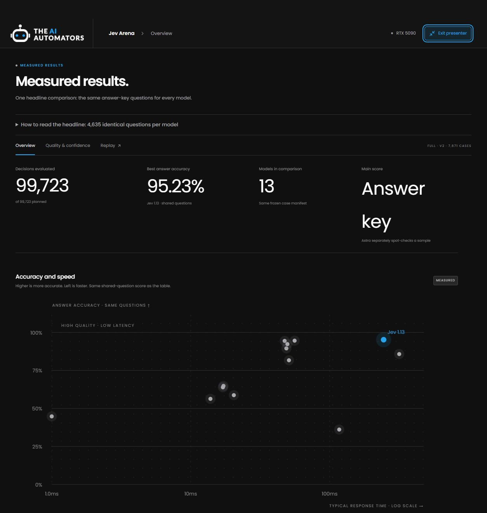

# Jev Arena

A local lab for comparing decision models inside real software workflows. Explore measured accuracy, speed, input limits and saved decisions, or configure a new test. Answer-key scores are calculated in code; a separate sample audit requests **GPT-6 Astra through Codex CLI**.

Development verification uses Windows, Docker Desktop and an RTX 5090 with 32 GB VRAM. Linux with the NVIDIA Container Toolkit is also supported by the installer. The portable HTML report viewer needs neither Docker nor a GPU.



*Dashboard from our completed evaluation. Raw run history and third-party case text stay local; a fresh checkout includes the app, methodology and aggregate evidence, not the private run database.*

## Why build this?

[JevBench Live](https://benchmarkheaven.com/jev-models) and [DecisionBench](https://huggingface.co/spaces/Hanno-Labs/decision-bench-leaderboard) are useful starting points for choosing models. Arena asks the next question: **how do the versions and serving settings I can actually deploy behave on my hardware and workload?**

We wanted inspectable failures, choice and context limits, measured load memory, short-input and long-input response times, and recorded workflow behavior. The follow-on ABCD assessment tests support decisions with a whole handbook versus retrieved policy. These assessments complement existing leaderboards; different cases, versions and scoring mean their percentages are not interchangeable. See the [source comparison and script rationale](docs/WHY-ARENA.md).

## Included

- Quality/latency plots, calibration, benchmark breakdowns, evidence inspection, coverage, paired intervals, performance blocks, and recorded warehouse/ticket-routing replays.
- Twelve local entrants/configurations: Plumb 4B, Decider 4B v2, Winnow 12B Q8, SemIf 4B, CLM 8B, Nimble 9B, three Laya checkpoints, Qwen 3.5 JSON, ModernBERT NLI, and a uniform control. Hosted Jev is an optional thirteenth entrant.
- **7,671 cases per entrant** before capability exclusions. Smoke has 36 formal cases; Demo has 36 formal + 72 original and 12 easy public JevBench cases (no hard cases) and four workflow episodes. Full adds dedicated timing, startup cycles, 40 untimed episodes and 40 episodes with a 500 ms decision deadline.
- Durable runs, reconnectable progress, cancel/resume, immutable input hashes, pinned checkpoints, isolated GPU workers, and a persisted hosted-service spending cap.
- ZIP exports with a self-contained interactive HTML report, JSON metrics/provenance and sanitized predictions. Credentials, private paths, CLI logs and raw third-party dataset text are excluded.

**This is a benchmark harness, not a claim that any model is the winner.** Read the [implemented methodology and limitations](docs/IMPLEMENTATION.md) before making video claims.

## Windows quick start

Install [Node.js 22+](https://nodejs.org/), [uv](https://docs.astral.sh/uv/), [Docker Desktop](https://docs.docker.com/desktop/) and a recent NVIDIA driver with working Docker GPU support. Reserve at least 150 GB, preferably 200 GB, for the full roster and images. Smaller selections use less storage.

```powershell
git clone https://github.com/theaiautomators/jev-arena.git
cd jev-arena
.\Start-Arena.ps1
```

Open **http://127.0.0.1:8787**. In Setup, choose entrants and **Prepare selected**. Preparation downloads pinned sources/datasets/checkpoints and builds the required workers. Progress is visible; detailed logs stay in `.arena/setup.log`.

To prepare a small starting roster from the terminal:

```powershell
.\Start-Arena.ps1 -Prepare -Models laya,plumb,decider
```

Open **Run a new test → Configure new test**. Run **Smoke** first, then **Demo** for filming or **Full** for the complete profile. Select ready excludes unconfigured hosted entrants. The final start action creates a separate run and can take hours; browsing results and replaying recordings do not run models or erase saved results.

## Linux quick start

Install Node/uv, Docker and the [NVIDIA Container Toolkit](https://docs.nvidia.com/datacenter/cloud-native/container-toolkit/latest/install-guide.html).

```sh
bash start-arena.sh
# Or prepare selected models on first launch:
bash start-arena.sh --prepare laya plumb decider
```

Winnow is compiled for CUDA architecture 120 by default (RTX 5090). Set `ARENA_CUDA_ARCH` for another GPU before preparation. Linux GPU inference and other GPUs are not inferred from the Windows/5090 verification; Linux CI checks the contracts and frontend without weights.

## Astra judge

The project installs a local Codex CLI. Authenticate it using your ChatGPT account:

```sh
npx codex login
```

Choose **Verify judge** in Setup. Arena explicitly requests `gpt-6-astra`; your account must have access. There is no direct OpenAI/Anthropic judge API client, API-key fallback or silent model substitution. Judging still consumes hosted Codex quota. The requested model is recorded separately from the observed identifier, which the tested CLI does not expose.

Run the frozen controls with:

```sh
uv run python -m arena.judge_controls
```

Judge batches are blinded, schema checked, tools disabled, time limited and resumable. Equal answers to the same case share one grade. Numeric metrics remain code-scored; Astra audits a fixed stratified sample and grades eligible provisional semantic cases. See [judge boundaries](docs/IMPLEMENTATION.md#judge).

## Optional Jev connection

Obtain a key from [TypeSafe](https://typesafe.ai). Copy `.env.example` to `.env`, set `TYPESAFE_API_KEY`, and restart Arena. The key stays server-side. The default cap is $5 per run, with conservative reservations persisted before requests and across resume. Never commit `.env`. The app does not purchase credits or create subscriptions.

## Reproduce and inspect

```sh
uv sync --frozen --extra dev
uv run pytest -q
npm ci
npm run build
uv run python -m scripts.verify_models laya plumb --preset smoke --judge
```

Checkpoints and source commits are pinned in `arena/registry.py` and `sources.lock.json`. Manifests record image IDs, weight/dependency hashes, hardware, code and inputs. Docker base images are digest pinned; the resulting image ID identifies the actual runtime. Resume refuses to mix changed code, weights or images into an existing run.

Private data lives under `.arena/`: datasets, weights, SQLite history, candidate inputs/outputs, judge evidence, timing blocks and cleanup checks. Use Export for sharing. The service binds to loopback, rejects foreign hosts/origins, and never stops unrelated containers. GPU workers have no network, a read-only filesystem, one weight mount and temporary caches. Do not expose the development service directly to the internet.

## Reading results

- Main accuracy excludes teacher/provisional labels. Failures count in supported-case accuracy; unsupported cases reduce coverage.
- Generated-label Qwen has no probability metrics. NLI probabilities are explicitly transformed entailment scores.
- Native probability vectors outside the fixed rounding tolerance are invalid, even when their top label seems plausible.
- Quality latency includes adapter overhead and failures. Dedicated serial timing is separate and does not claim peak vendor throughput.
- Replays align sequential recordings at zero, show playback speed, and keep every seed selectable.
- A completed run means configured stages finished, not that every answer was correct. Formal fixtures are not a human-audited semantic benchmark.

## ABCD conversations

Choose **Case explorer → Assessment → ABCD support conversations** to browse locally saved cases. Filter by policy condition, decision type or conversation ID; inspect the exact saved input, its answer key and each model’s response. The answer key and provenance are shown separately from the input. The synthetic context controls are separately labelled.

Raw ABCD conversations and predictions are not distributed in this repository or the portable viewer. Without a local assessment, the explorer explains that the data is unavailable. The [ABCD results](docs/ABCD-RESULTS.md), [protocol](docs/ABCD-PROTOCOL.md) and aggregate evidence remain public. ABCD involved five profiles and a different task, so it is not added to the thirteen-profile Arena accuracy total.

## Further reading

- [Shared micro-app layout and integration guide](apps/shared/README.md)
- [Research and YouTube coverage](RESEARCH.md)
- [Original build plan](PLAN.md) and [proposed full protocol](EVALUATION.md)
- [Implemented profile and limitations](docs/IMPLEMENTATION.md)
- [Verification evidence](docs/VERIFICATION.md) and [independent adversarial review](docs/ADVERSARIAL-REVIEW.md)
- [Builder takeaways](docs/BUILDER-TAKEAWAYS.md) and [Winnow loaded-memory measurements](docs/evidence/winnow-memory.json)
- [Measured results](docs/RESULTS.md), [video spine](docs/VIDEO-SPINE.md) and [teleprompter script](docs/VIDEO-SCRIPT.txt)
- [Reference cautions and post-hoc sensitivity](docs/REFERENCE-CAUTIONS.md)
- [Licenses and attribution](THIRD_PARTY.md)

Arena's original code is [MIT licensed](LICENSE). Weights, datasets and reference runtimes retain their own terms and are downloaded from their publishers. Jev Arena is an independent project, unaffiliated with TypeSafe or the model authors.
